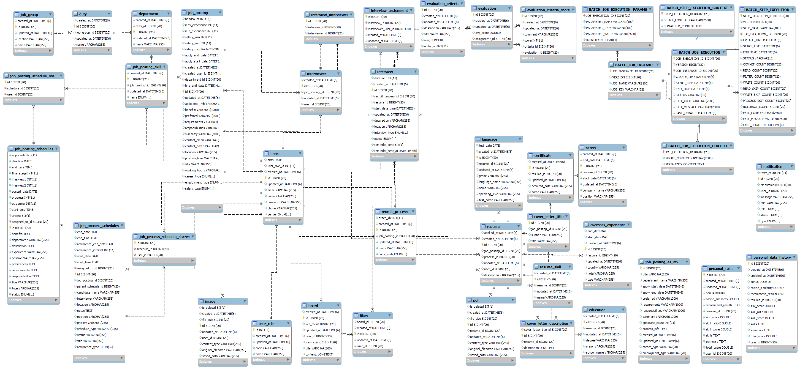
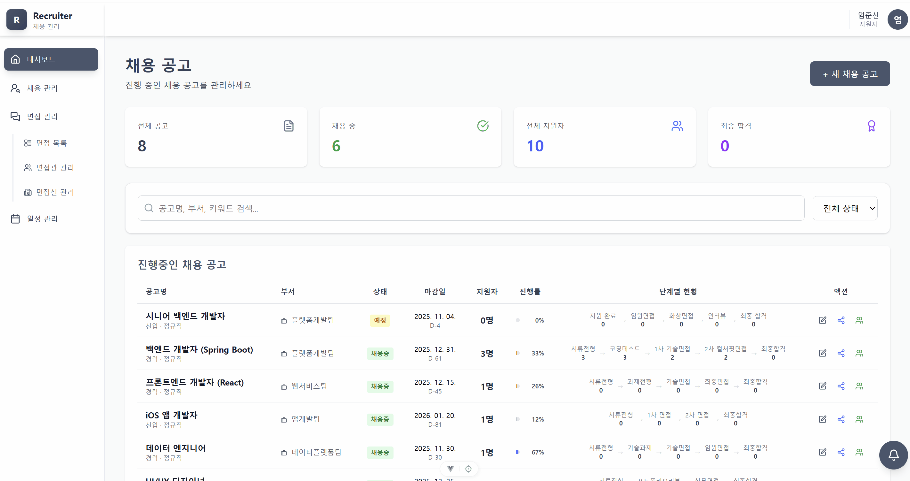
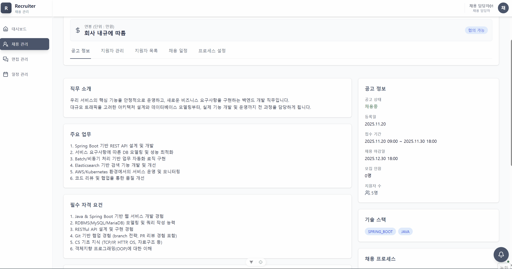
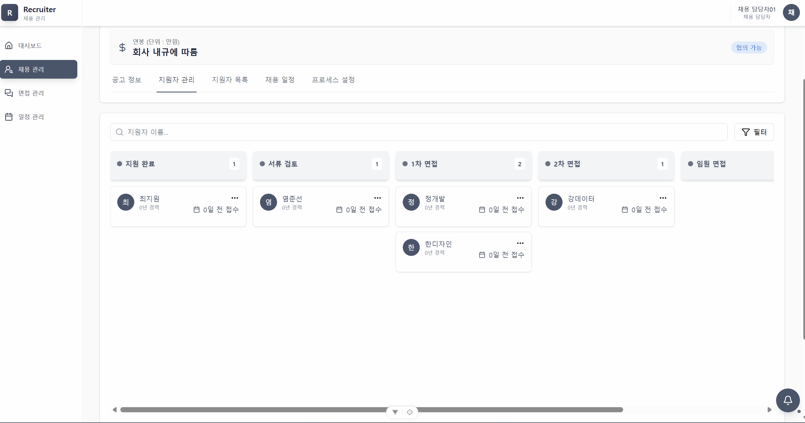
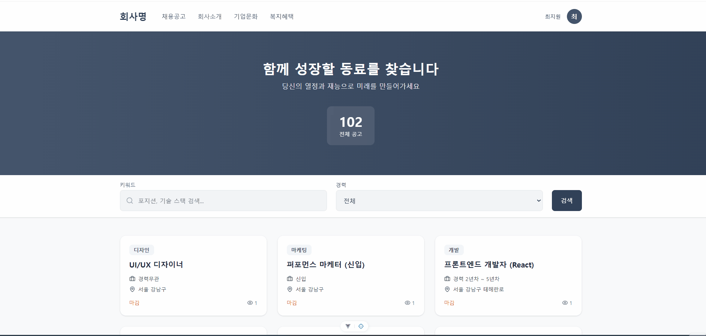
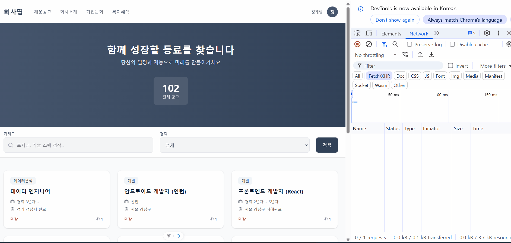

<h1 align="center">
    
    CoreBridge
</h1>

  

  

---

# 실제 배포 접속 주소

## 프론트

* 

## 백엔드

* 

## URL 정리

* `https://www.core-bridge.co.kr/jobs~` : 모든 권한의 사용자
* `https://www.core-bridge.co.kr/amdin/~` : 관리자, 채용 담당자, 면접관

# 테스트 계정

## 관리자

* ID : `admin01@core-bridge.co.kr`
* PW : `qwer1234`

## 채용 담당자

* ID : `recruiter01@core-bridge.co.kr`
* PW : `qwer1234`

## 면접관

* ID : `interviewer01@core-bridge.co.kr`
* PW : `qwer1234`

## 지원자

* ID : `wnstjs1031@naver.com`
* PW : `qwer1234`

---

# 📑 목차 (Table of Contents)

- [프로젝트 기획과 설계](#프로젝트-기획과-설계)
    + [1. 시스템 아키텍처](#-1-시스템-아키텍처)
    + [2. ERD](#-2-erd)

- [나의 역할 소개](#-프로젝트-소개)
    * [1. 내가 맡은 주요기능](#1-개요)
    * [2. DB 성능 개선](#2-핵심-기능)
    * [3. 추후 개선사항](#3-Es)

---

# 프로젝트 기획과 설계

## 🔧 1. 시스템 아키텍처

## 🔗 2. ERD

# 나의 역할 소개

## 1. 내가 맡은 주요기능

### 채용공고 등록 기능
채용공고를 생성할 때, 등록 가능한 부서/기술스택/근무지를 사전 조회하여 데이터 정합성 보장하도록 설계

### 채용공고 전체조회 및 상세조회 기능
채용공고 조회시 각 채용공고별 필요한 데이터를 정제해서 조회토록 구현

### 채용공고 지원현황 조회
칸반보드를 활용한 공고별 지원자들의 단계 확인

### 채용공고 지원자수 시각화
공고별 지원자 수를 차트를 통한 시각화 구현

### 지원자의 현재 지원현황 조회
지원자가 지원한 프로세스 조회 구현

### 지원자 채용공고 조회
지원자가 어떤 공고가 있는지 확인하는 기능 구현

